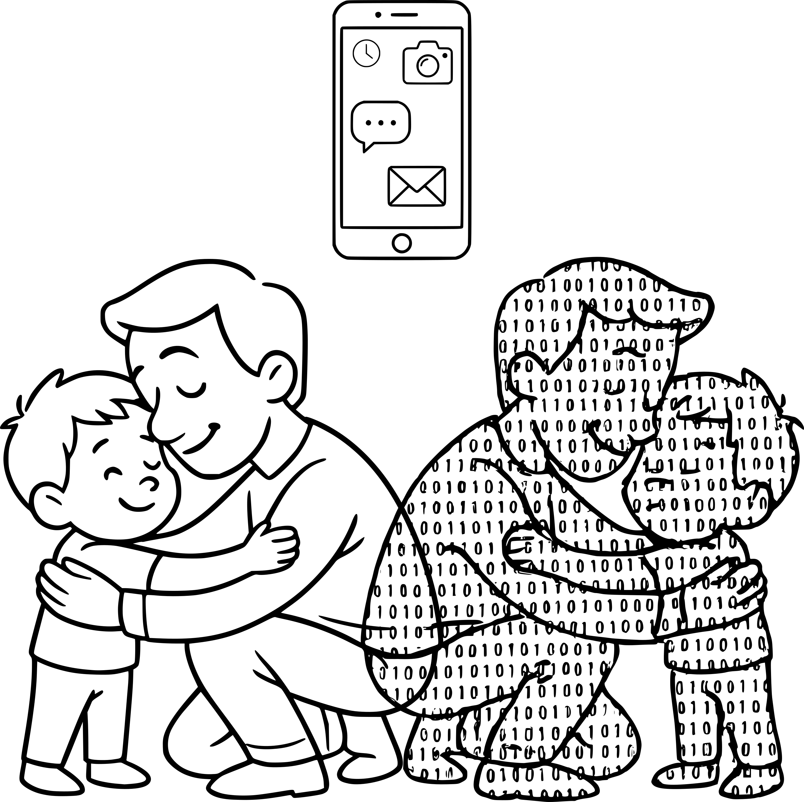

# Patto Digitale Familiare Open Source

> **Un modello di accordo collaborativo, modulare ed evolutivo tra genitori e figli per un uso consapevole della tecnologia.**
> Un progetto aperto da un'idea del libro e della community di **[Genitori in 2 Dimensioni](https://genitori2d.it)**.

---

  

---

## Cos'è questo progetto?

Educare i figli nell'era digitale è una delle sfide più complesse per i genitori di oggi. Spesso ci si trova da soli a negoziare regole su orari, videogiochi e smartphone.

Abbiamo creato questo **Patto Digitale Open Source** per offrire alle famiglie una base di partenza chiara, verificata da esperti e adattabile all'età dei figli. 

Poiché la tecnologia e le abitudini cambiano velocemente, **questo documento non è scolpito nella pietra**: cresce e si migliora grazie all'esperienza di tutti i genitori.

---

## I Patti per Fascia d'Età

Puoi consultare e scaricare il patto più adatto alla fase di crescita di tuo figlio/a:

1. 🟢 **[Fascia 0-6 anni](./patti/01-fase-0-6-anni.md):** Zero schermi personali, sviluppo e protezione.
2. 🟡 **[Fascia 6-11 anni](./patti/02-fase-6-11-anni.md):** Primo approccio guidato, nessun telefono personale.
3. 🔴 **[Fascia 12-14 anni](./patti/03-fase-12-14-anni.md):** L'arrivo del primo smartphone e la netiquette.
4. 🔵 **[Fascia 15-18 anni](./patti/04-fase-15-18-anni.md):** Autonomia responsabile e reputazione digitale.

---

## Non usi GitHub? Come puoi proporre idee e modifiche (In modo semplice)

Non serve essere un programmatore o un esperto di informatica per contribuire a questo patto! Se hai un'idea, vuoi suggerire una nuova regola o vuoi condividere un'esperienza:

1. **Crea un account gratuito su GitHub** (se non ce l'hai già).
2. **Vai nella sezione "Issues"** in alto in questa pagina (oppure [clicca qui per aprire una segnalazione](https://github.com/genitori2d/PattoDigitale/issues)).
3. Clicca sul pulsante verde **"New Issue"**.
4. Scrivi il tuo messaggio, come se fosse un'email o un post su un forum:
   - *Esempio:* "Vorrei proporre una regola per la gestione della TV in camera."
   - *Esempio:* "Nella fascia 6-11 anni consiglio di aggiungere il limite d'uso per Roblox."
5. Clicca su **"Submit new issue"**. Leggeremo il tuo spunto e lo integreremo nel patto!

---

## Per i genitori digitalizzati e sviluppatori

Se hai familiarità con Git, Markdown e Pull Request, leggi il nostro file **[CONTRIBUTING.md](./CONTRIBUTING.md)** per scoprire come inviare direttamente le tue modifiche al codice dei patti.

---

*Promosso da [Genitori in 2 Dimensioni](https://genitori2d.it) — Educare i nativi digitali alle due dimensioni del sociale*
